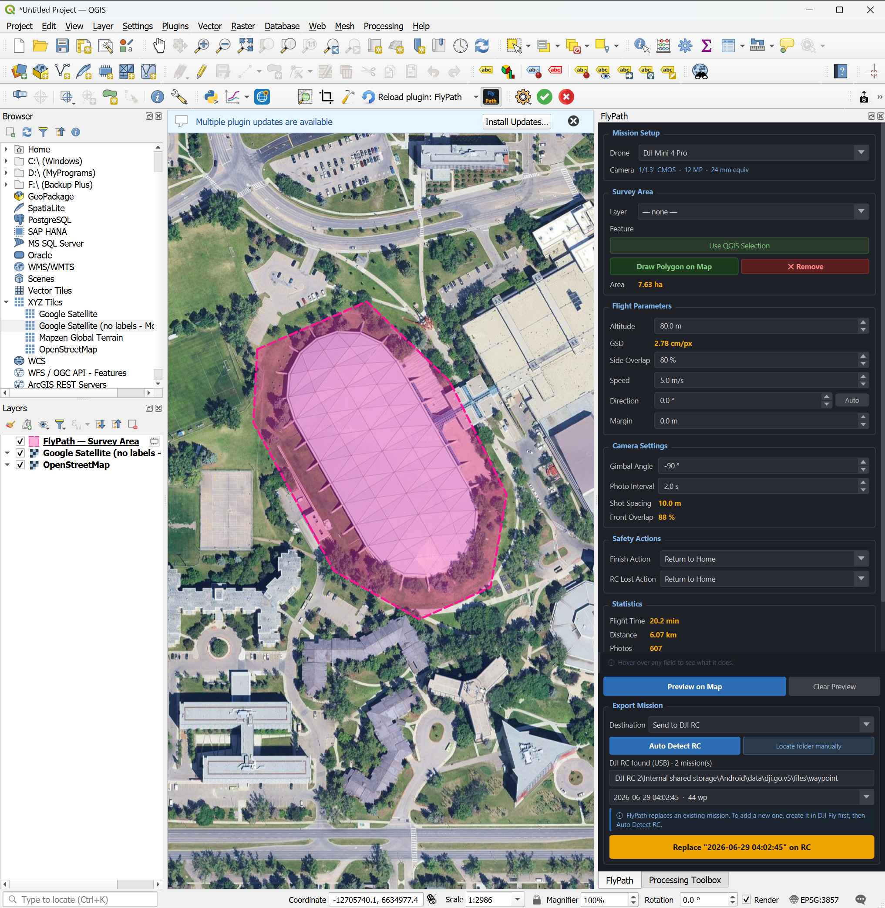
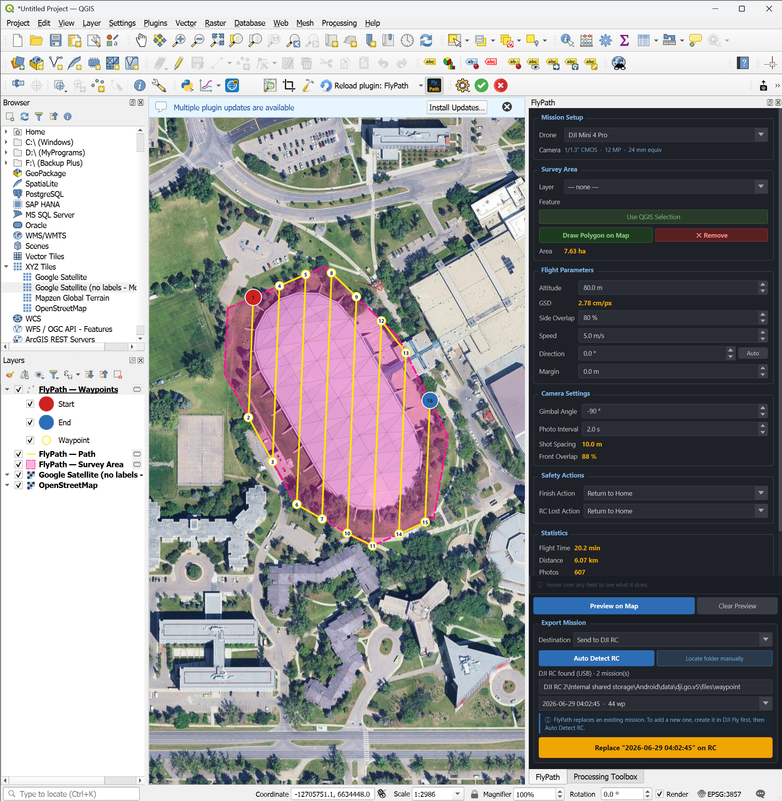
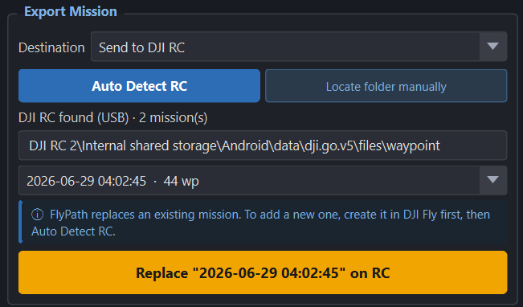

<div align="center">
  
</div>

# FlyPath

**FlyPath** is an open-source QGIS plugin for planning autonomous drone mapping missions and exporting them as native DJI WPML KMZ files, with no conversion tools or third-party apps required.

Define your survey area directly on the map, configure flight parameters, preview the path, and export a ready-to-fly mission file loadable in the DJI Fly app.

Developed and maintained by [Dronnix](https://www.dronnix.com), a drone mapping and geospatial AI company.

---

## Screenshots





---

## Key Features

- Draw the survey area directly on the QGIS map canvas using a native polygon drawing tool
- Import a survey area from any polygon layer or active QGIS selection
- Configurable flight altitude, speed, gimbal angle, photo interval, side overlap, and flight direction
- Photo Interval parameter for planning along-track overlap, used as a reference to set the drone's auto interval capture mode manually before flying
- Calculated front overlap display, showing effective along-track overlap from speed x interval with low-overlap warnings
- Auto-optimised flight direction based on survey area geometry
- Live GSD and effective photo spacing, synced to drone model, altitude, speed, and interval
- Flight statistics: area, path distance, waypoint count, photo count, estimated batteries, and flight time
- Configurable safety actions: finish action and RC lost action
- Exports native DJI WPML KMZ, compatible with DJI Fly on DJI RC2
- **Direct RC export**: set the RC waypoint folder path once and FlyPath automatically finds and replaces the latest mission on the controller via USB
- **Local folder export**: set any local or external drive path and FlyPath saves directly to that folder
- Contextual info bar, hover over any parameter to see what it does
- Dark-themed dock panel, designed to complement the QGIS interface

---

## Requirements

| Requirement | Details |
|---|---|
| Operating System | Windows 10 / 11 |
| QGIS | 3.16 or later (4.x supported) |
| Python | 3.9+ (bundled with QGIS) |
| Drone | DJI Mini 3 Pro, Mini 4 Pro, or Mini 5 Pro |
| Controller | DJI RC2 (for direct USB export) |

> Linux and macOS support is planned for a future release.

---

## Installation

### Option A - QGIS Plugin Manager *(recommended)*

1. In QGIS go to **Plugins > Manage and Install Plugins**
2. Search for **FlyPath** and click **Install Plugin**

### Option B - Install from ZIP

1. Download the latest `FlyPath.zip` from the [Releases](https://github.com/dronnix-io/FlyPath/releases) page
2. In QGIS go to **Plugins > Manage and Install Plugins > Install from ZIP**
3. Select the downloaded ZIP and click **Install Plugin**

### Option C - Build from source

```shell
git clone https://github.com/dronnix-io/FlyPath.git
```

Copy the `FlyPath` folder into your QGIS plugins directory:

```
Windows: C:\Users\<you>\AppData\Roaming\QGIS\QGIS3\profiles\default\python\plugins\
```

Then enable it in QGIS via **Plugins > Manage and Install Plugins > Installed > FlyPath**.

### Launch the plugin

After installation, open FlyPath via:

**Plugins > FlyPath > FlyPath**

Or click the **FlyPath icon** in the QGIS toolbar. The plugin opens as a dock panel on the right side of the QGIS window.

---

## Workflow

### Step 1 - Define the survey area

Three ways to define your survey polygon:

- **Draw on Map**: click the button to activate the drawing tool, left-click to place vertices, right-click to finish. Backspace removes the last vertex, Escape cancels.
- **Layer / Feature**: select any polygon layer and feature already loaded in QGIS.
- **Use QGIS Selection**: select a polygon feature on the map canvas using QGIS's native selection tools, then click **Use QGIS Selection**.

Only one polygon can be active at a time. Switching methods automatically removes the previous survey area.

### Step 2 - Configure flight parameters

#### Flight Parameters

| Parameter | Description |
|---|---|
| Drone Model | Sets camera specs used for GSD and spacing calculations |
| Altitude | Flight altitude above ground level (AGL) in metres |
| GSD | Calculated ground sampling distance, updates live with altitude |
| Side Overlap | Cross-track strip spacing overlap, controls distance between flight lines |
| Speed | Waypoint flight speed in m/s (max varies by drone model) |
| Direction | Angle of flight lines, or click **Auto** to optimise for the survey shape |
| Margin | Buffer added around the survey polygon boundary in metres |

#### Camera Settings

| Parameter | Description |
|---|---|
| Gimbal Angle | Camera tilt: -90 degrees points straight down (nadir) for 2D mapping |
| Photo Interval | Time between photos in seconds (minimum 2 s at 12 MP JPEG) |
| Shot Spacing | Calculated: speed x interval in metres, updates live |
| Front Overlap | Calculated: effective along-track overlap percentage, turns red if too low |

> **Note:** Front overlap is a derived value, not a manual input. Adjust speed or interval to control it.

> **Important - Photo triggering on DJI Mini 3 Pro, Mini 4 Pro, and Mini 5 Pro:** DJI consumer drones do not support WPML-based camera auto-triggering. Before starting the mission, manually enable auto interval capture mode on the drone and set it to match the Photo Interval value shown in FlyPath. The Photo Interval parameter is a planning reference that lets you estimate front overlap and tune your speed and altitude accordingly.

#### Safety Actions

| Parameter | Description |
|---|---|
| Finish Action | What the drone does after the last waypoint (Return to Home / Hover / Land) |
| RC Lost Action | What the drone does if RC signal is lost (Return to Home / Hover / Land / Continue) |

GSD, shot spacing, and front overlap update live as you adjust parameters.

### Step 3 - Preview on Map

Click **Preview on Map** to generate the flight grid and display it on the canvas:

- **Deep pink polygon**: survey area boundary
- **Electric yellow lines**: flight path connecting all waypoints
- **Electric yellow circles**: mid-waypoints
- **Red filled circle**: start waypoint
- **Blue filled circle**: end waypoint

Flight statistics (area, distance, photos, batteries, flight time) update below the parameters.



### Step 4 - Export KMZ

The action bar has a **Destination** selector with two modes: *Save to computer* and *Send to DJI RC*. The **Export** button changes its label to match what it will do.

---

#### Save to computer

Use this to save the mission as a `.kmz` file on your PC or an external drive.

1. Set **Destination** to *Save to computer*.
2. Click **Browse…** and choose a folder (the folder is remembered for next time).
3. Click **Export KMZ**. A save dialog opens with a dated default filename.
4. After saving, FlyPath offers to open the folder.

---

#### Send to DJI RC

This replaces an existing mission directly on the DJI RC over USB, with no manual copying or renaming.

> **Important:** FlyPath can only **replace** a mission that already exists on the RC. It cannot create a brand-new one that appears in the DJI Fly app. To add a mission, create it in DJI Fly first (even a 3-point dummy), then click Detect RC.

**Prerequisites:**
- Create at least one waypoint mission in DJI Fly on the RC. This is the "slot" FlyPath fills.
- Connect the RC to your PC via USB and enable file transfer on it.

**Steps:**

1. Set **Destination** to *Send to DJI RC*.
2. Click **Detect RC**. FlyPath finds the RC over USB and lists its missions, each shown by date and waypoint count (only missions DJI Fly actually tracks are listed).
3. If the RC is not auto-detected (for example it appears as an SD card or a mapped drive), click **Locate folder…** and browse to the `waypoint` folder yourself.
4. If the folder is found but has no missions, FlyPath tells you to create one in DJI Fly first (see the Important note above).
5. Pick the mission you want to replace. Use the date to match what you see in DJI Fly.
6. Click **Replace "…" on RC**. FlyPath writes the new mission into the selected UUID folder.
7. Disconnect the RC, then close and reopen DJI Fly to see the updated mission.

---

## Supported Drones

| Drone | Waypoint Support | droneEnumValue | Verification |
|---|---|---|---|
| DJI Mini 3 Pro | Yes | 97 | Community-verified |
| DJI Mini 4 Pro | Yes | 68 | Verified from native RC2 mission dump |
| DJI Mini 5 Pro | Yes | 68 | Community-verified |

> **Note:** DJI Mini 3 (standard) does **not** support waypoint missions and is not supported by FlyPath.

---

## Project Structure

```
FlyPath/
├── flypath.py            # QGIS plugin entry point
├── flypath_dialog.py     # Main UI panel and export logic
├── map_tools.py          # Interactive polygon drawing tool
├── grid_planner.py       # Flight grid and waypoint generation
├── wpml_writer.py        # DJI WPML KMZ file writer
├── metadata.txt          # QGIS plugin metadata
├── icon.png              # Plugin icon
├── icon.svg              # Plugin icon source
└── docs/
    └── images/           # README screenshots
```

---

## Known Limitations

- Tested and verified on Windows 10 / 11 only, Linux and macOS support is planned for a future release
- Direct RC export requires a DJI RC2 connected via USB with at least one existing mission
- DJI Mini 3 Pro droneEnumValue (`97`) is community-verified, not confirmed from a native mission file
- 2D grid missions only, no terrain following, 3D facade, or orbit missions
- No automatic multi-battery mission splitting

---

## Contributing

Contributions are welcome. To get started:

1. Fork the repository
2. Create a feature branch: `git checkout -b feature/your-feature`
3. Commit your changes
4. Open a pull request against `main`

For bug reports and feature requests, please use the [issue tracker](https://github.com/dronnix-io/FlyPath/issues).

---

## License

This project is licensed under the **GNU General Public License v3.0**, see the [LICENSE](LICENSE) file for details.

---

## About Dronnix

[Dronnix](https://www.dronnix.com) is a drone mapping and geospatial AI company specialising in data collection and analysis for solar panel inspection, agriculture, urban growth monitoring, construction progress tracking, and large-scale mapping missions.

FlyPath is part of Dronnix's open tooling layer, free and open-source to support the drone mapping community.

**Contact:** [salar@dronnix.com](mailto:salar@dronnix.com)
